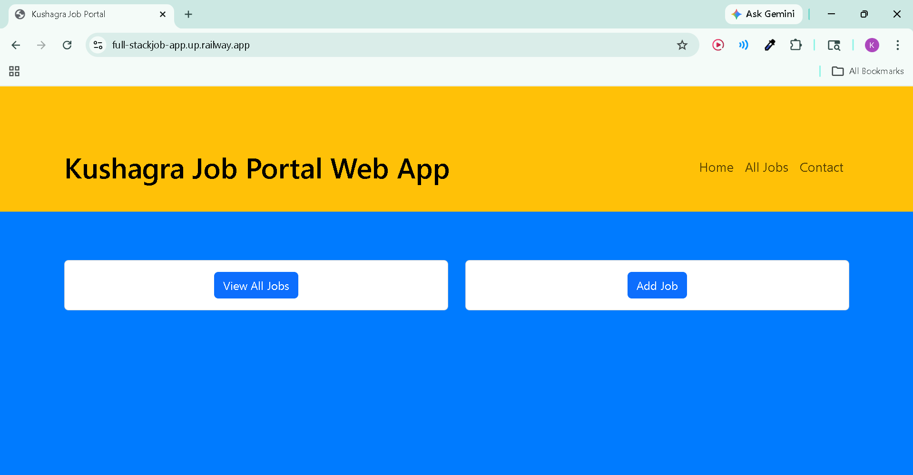
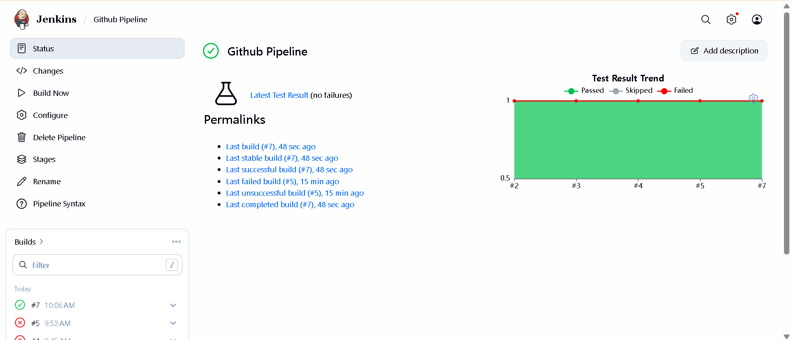

# JobApp - Full Stack Spring Boot & CI/CD Pipeline

<p align="center">
  
</p>

This project is a comprehensive **Job Portal Web Application** built using **Spring Boot** and managed with a professional **Jenkins CI/CD Pipeline**. It showcases full-stack development skills alongside modern DevOps practices.

---

## 💻 Application Features & Architecture
The **JobApp** is built with a robust internal structure:

* **MVC Architecture**: Organized into clean layers—Model (`JobPost.java`), View (JSP), and Controller (`JobController.java`).
* **View Technologies**: Uses **JSP (JavaServer Pages)** for dynamic content rendering with custom CSS (`style.css`, `style1.css`).
* **REST API**: The `JobController` exposes REST endpoints to allow external systems to programmatically access job information.
* **Service & Repo Layers**: Includes dedicated service and repository packages for scalable data handling.


---

## ⚙️ DevOps & CI Pipeline
The project features a **Declarative Jenkins Pipeline** that automates the software lifecycle:

1.  **Workspace Cleanup**: Ensures a fresh environment using `deleteDir()`.
2.  **Build Stage**: Uses **Maven** to compile the project and resolve dependencies.
3.  **Test Stage**: Runs unit tests automatically to ensure code quality.
4.  **Deliver Stage**: Executes a custom `deliver.sh` script to verify the generated `.jar` artifact.

### Pipeline as Code
```groovy
pipeline {
    agent any
    stages {
        stage('Build') {
            steps {
                sh 'mvn clean install'
            }
        }
        stage('Deliver') {
            steps {
                sh './jenkins/scripts/deliver.sh'
            }
        }
    }
}

## Pipeline Insights

### Status Dashboard


## Build Performance

| Metric | Value |
| :--- | :--- |
| **Total Build Time** | ~5 seconds |
| **Tests Run** | 1 |
| **Build Status** | **SUCCESS** |

**Author:** Kushagra  
*DevOps & Full Stack Enthusiast* 
